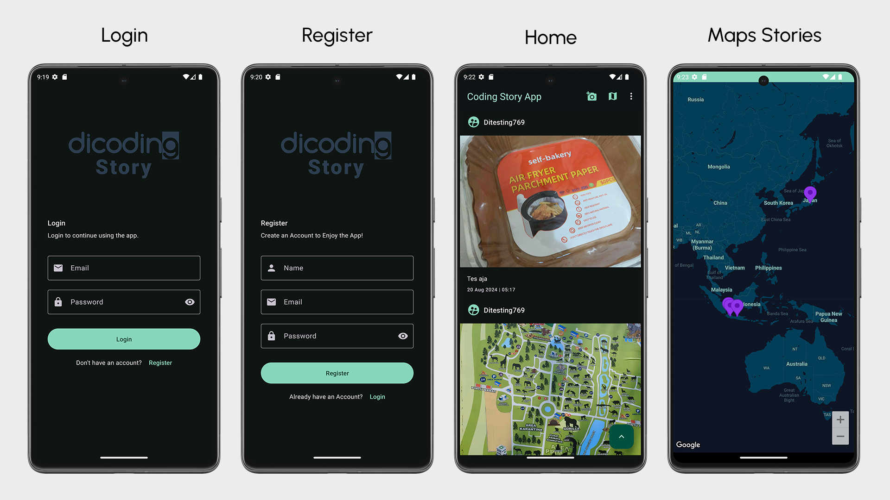
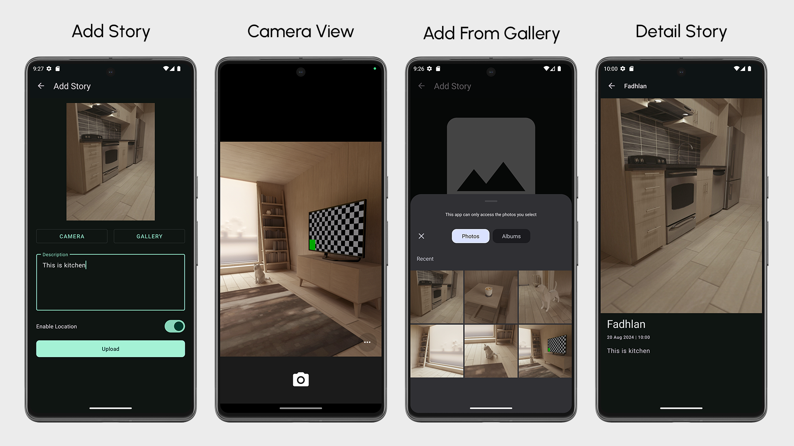

# Coding Story App

This is an Android application designed for sharing stories from the Dicoding academy. The application retrieves data using the Dicoding API and integrates various modern Android development technologies.

## Features

- **Stories Sharing**: Share your stories from the Dicoding academy.
- **Maps Stories**: View stories on a map, enabled by the Google Maps API.
- **Data Persistence**: Utilizes Room for local database management.
- **Pagination**: Implements Paging 3 library with RemoteMediator and Remote Keys.
- **Networking**: Uses Retrofit for networking.
- **State Management**: LiveData for observing data changes.
- **Preferences and Token Storage**: DataStore for managing user preferences and storing login tokens.
- **Dependency Injection**: Service Locator pattern for dependency injection.
- **Location Services**: Integrated with FusedLocationProviderClient for location-based features.
- **Coroutines**: Manages asynchronous operations using Kotlin Coroutines.

## Prerequisites
- Android Studio
- Google Cloud Platform API Key for Maps (optional)

### Setup Project
1. **Clone the repository**:
    ```bash
    git clone https://github.com/fadhlansulistiyo/CodingStoryApp.git
    ```

2. **Add your MAPS_API_KEY**:
    - Obtain your API key from the [Google Cloud Platform](https://cloud.google.com/maps-platform/).
    - Add the following line to your `local.properties` file located in the project root:
      ```
      MAPS_API_KEY=your_api_key_here
      ```

3. **Build and Run the project**

## Tech Stack

- **Material Design Components**: `com.google.android.material:material`
- **Room Database**: `androidx.room:room-runtime`, `androidx.room:room-ktx`
- **Paging 3**: `androidx.paging:paging-runtime-ktx`
- **Retrofit**: `com.squareup.retrofit2:retrofit`, `com.squareup.retrofit2:converter-gson`
- **LiveData**: `androidx.lifecycle:lifecycle-livedata-ktx`
- **DataStore**: `androidx.datastore:datastore-preferences`
- **Google Maps API**: `com.google.android.gms:play-services-maps`
- **FusedLocationProviderClient**: `com.google.android.gms:play-services-location`
- **Kotlin Coroutines**: `org.jetbrains.kotlinx:kotlinx-coroutines-core`, `org.jetbrains.kotlinx:kotlinx-coroutines-android`

## Screenshots (Dark Theme)



## Acknowledgements
This project was developed as part of the Final Submission for the [Dicoding](https://www.dicoding.com/academies/352) class - Learn Intermediate Android Application Development (Belajar Pengembangan Aplikasi Android Intermediate). Special thanks to Dicoding for providing comprehensive learning resources and guidance throughout the course.

## Contact

For any inquiries or feedback, please contact [fadhlansulistiyo@gmail.com].
