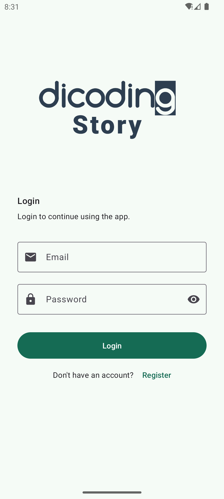
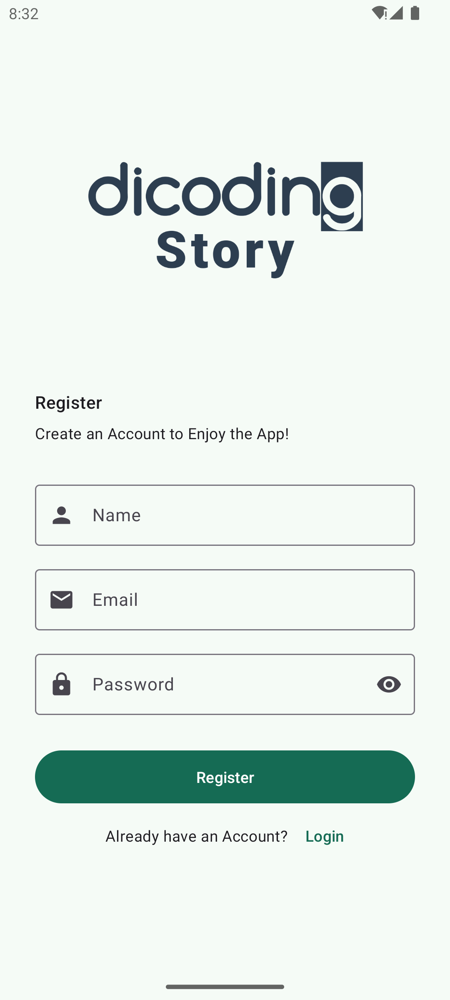
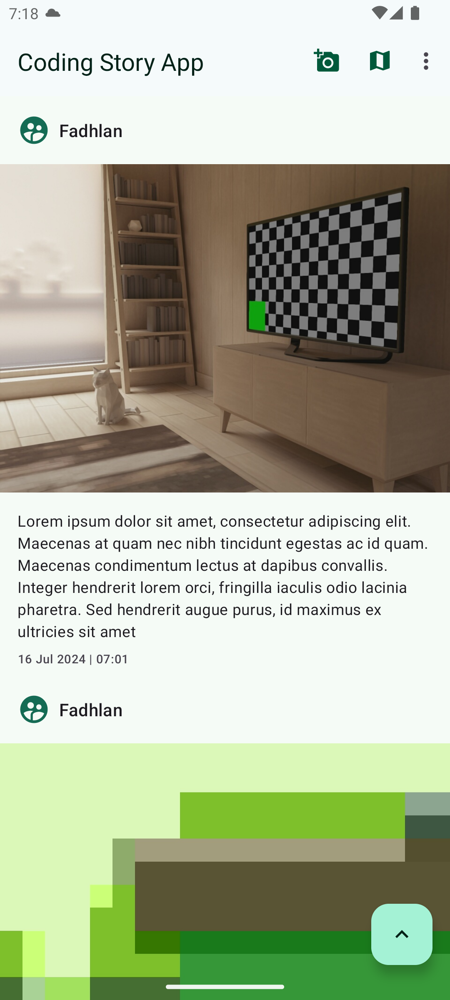
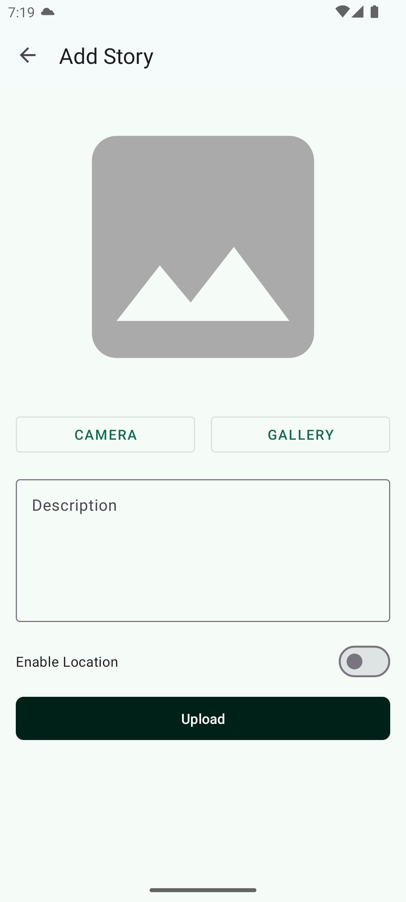
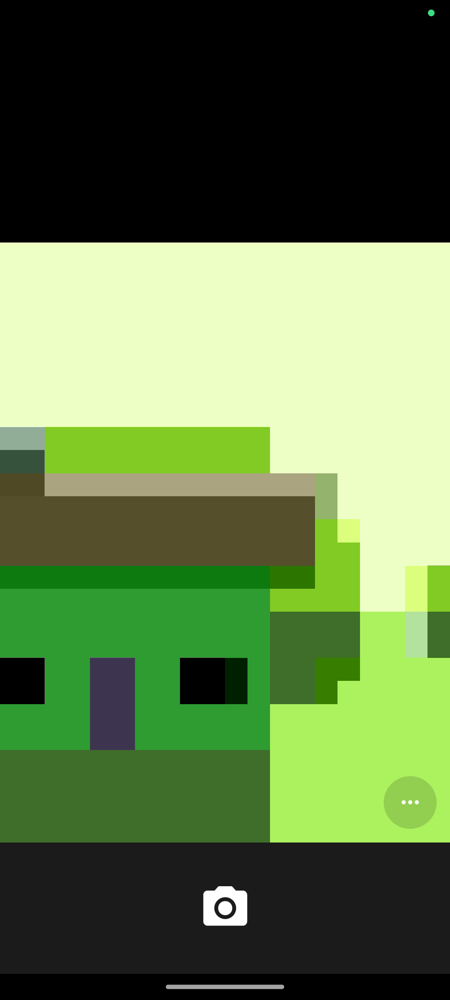
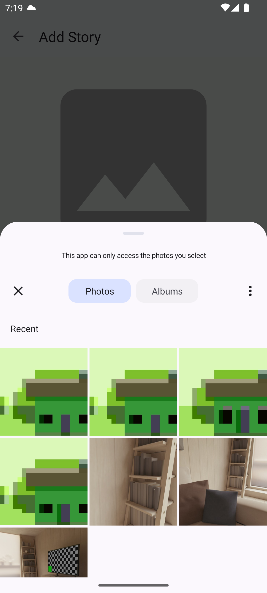
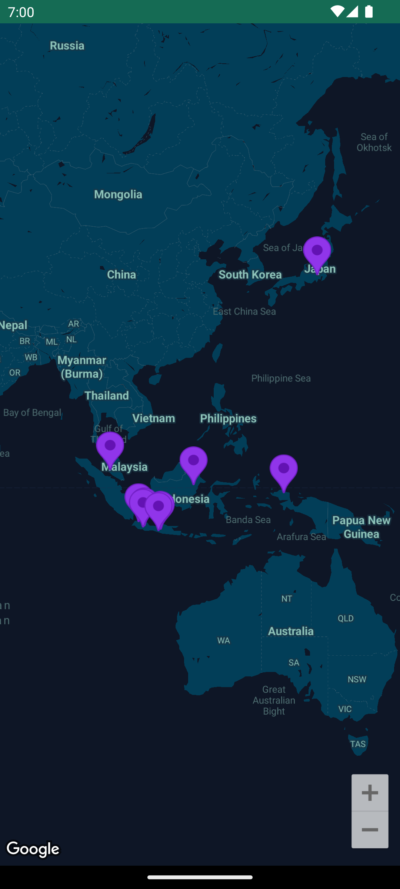

# Dicoding Stories Sharing App

This is an Android application designed for sharing stories from the Dicoding academy. The application retrieves data using the Dicoding API and integrates various modern Android development technologies.

## Application Demo

Here are some screenshots demonstrating the application features:

       

## Features

- **Stories Sharing**: Share your stories from the Dicoding academy.
- **Maps Stories**: View stories on a map, enabled by the Google Maps API.
- **Data Persistence**: Utilizes Room for local database management.
- **Pagination**: Implements Paging 3 library with RemoteMediator and Remote Keys.
- **Networking**: Uses Retrofit for networking.
- **State Management**: LiveData for observing data changes.
- **Preferences and Token Storage**: DataStore for managing user preferences and storing login tokens.
- **Dependency Injection**: Service Locator pattern for dependency injection.
- **Location Services**: Integrated with FusedLocationProviderClient for location-based features.
- **Coroutines**: Manages asynchronous operations using Kotlin Coroutines.

## Prerequisites

- Android Studio
- Kotlin
- Google Cloud Platform API Key for Maps

## Getting Started

1. **Clone the repository**:
    ```bash
    git clone https://github.com/fadhlansulistiyo/CodingStoryApp.git
    ```

2. **Add your MAPS_API_KEY**:
    - Obtain your API key from the [Google Cloud Platform](https://cloud.google.com/maps-platform/).
    - Add the following line to your `local.properties` file located in the project root:
      ```
      MAPS_API_KEY=your_api_key_here
      ```

3. **Open the project in Android Studio**:
    - Import the project into Android Studio.
    - Sync the project to ensure all dependencies are downloaded.

4. **Build and Run the project**:
    - Connect an Android device or start an emulator.
    - Click on the "Run" button in Android Studio.

## Dependencies

The project uses the following dependencies:

- **Material Design Components**: `com.google.android.material:material`
- **Room Database**: `androidx.room:room-runtime`, `androidx.room:room-ktx`
- **Paging 3**: `androidx.paging:paging-runtime-ktx`
- **Retrofit**: `com.squareup.retrofit2:retrofit`, `com.squareup.retrofit2:converter-gson`
- **LiveData**: `androidx.lifecycle:lifecycle-livedata-ktx`
- **DataStore**: `androidx.datastore:datastore-preferences`
- **Google Maps API**: `com.google.android.gms:play-services-maps`
- **FusedLocationProviderClient**: `com.google.android.gms:play-services-location`
- **Kotlin Coroutines**: `org.jetbrains.kotlinx:kotlinx-coroutines-core`, `org.jetbrains.kotlinx:kotlinx-coroutines-android`

## Acknowledgements

- [Dicoding Academy](https://www.dicoding.com/)
- [Google Maps API](https://cloud.google.com/maps-platform/)

## Contact

For any inquiries or feedback, please contact [fadhlansulistiyo@gmail.com].
